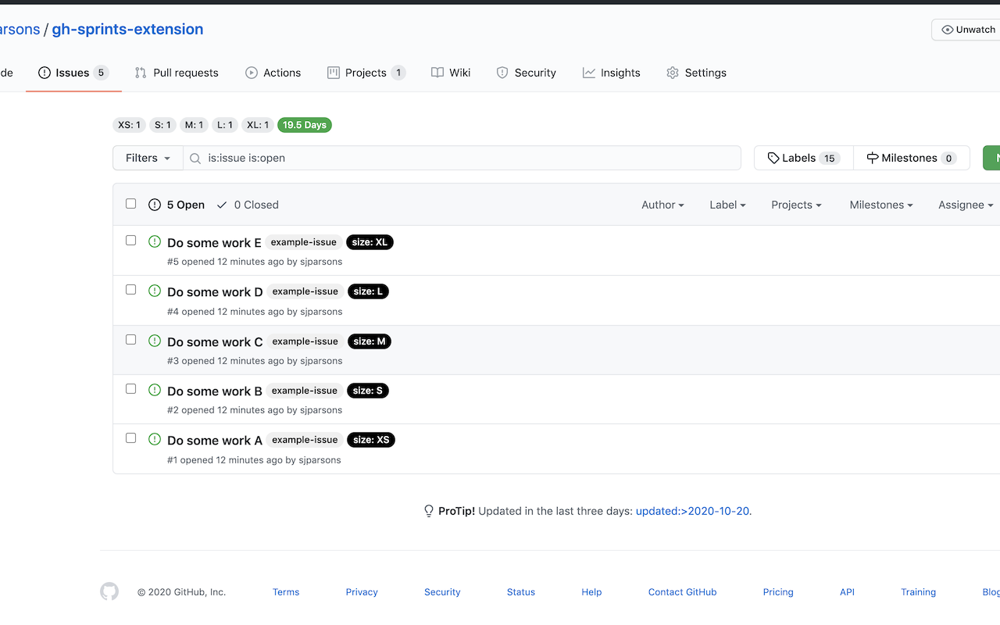
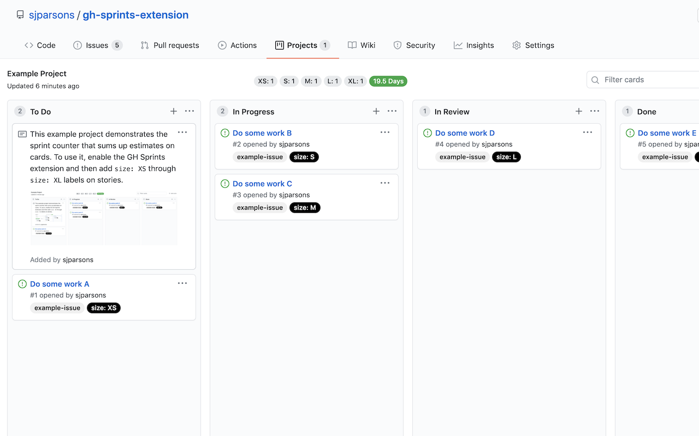

# GH Sprints

This Chrome extension adds a simple counter of sizes of cards and adds them up for quick story estimation.

## Features

- Story counter at the top of Issues and Projects pages
- More coming...

**Story counter on Issues page**

**Story counter on Projects page**

## Installing

This extension is currently pending review in the Chrome Web Store, so for now you need to install it manually.

1. Go to [Releases](https://github.com/sjparsons/gh-sprints-extension/releases), select the most recent release
2. Download the `gh-sprints-*.zip` file from assets and unzip somewhere on your computer
3. Open Google Chrome and navigate to `Extensions`
4. Enable `Developer mode`
5. Select `Load unpacked` and then in the window navigate to the folder you unzipped in step 2 and select it.

To use the plugin, just navigate to a projects or issues page in GitHub or GitHub Enterprise.